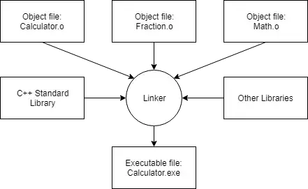

#### Learning C++ to finish projects
- How C++ works:
  - C++ is a high-level language: it is closer to human language than machine language
  - C++ is a statically typed: the type of a variable is known at compile time;
  - C++ is a compiled language: the code is compiled into machine code before it is run; using a compiler like g++ or clang++
- What C++ good at?
  - C++ excels in situations where high performance and precise control over memory and other resources is needed
  - video games, real-time systems, financial app, embedded systems, and more
    
#### Introduction to C++ development
- Compiling your source code: the compiler translates your C++ code into machine language instructions. These instructions are stored in an intermediate file called an **object file**

- Linking object files and libraries:  The linker’s job is to combine all of the object files and produce the desired output file

#### Basic C++ syntax
- Variables and basic data types: int, double, std::string, char, bool
- Const
- Namespaces 
- Typedef and type aliases
- Arithmetic operators
- Type conversion
- User input 
- Useful math related functions
- Hypotenuse calculator practice program