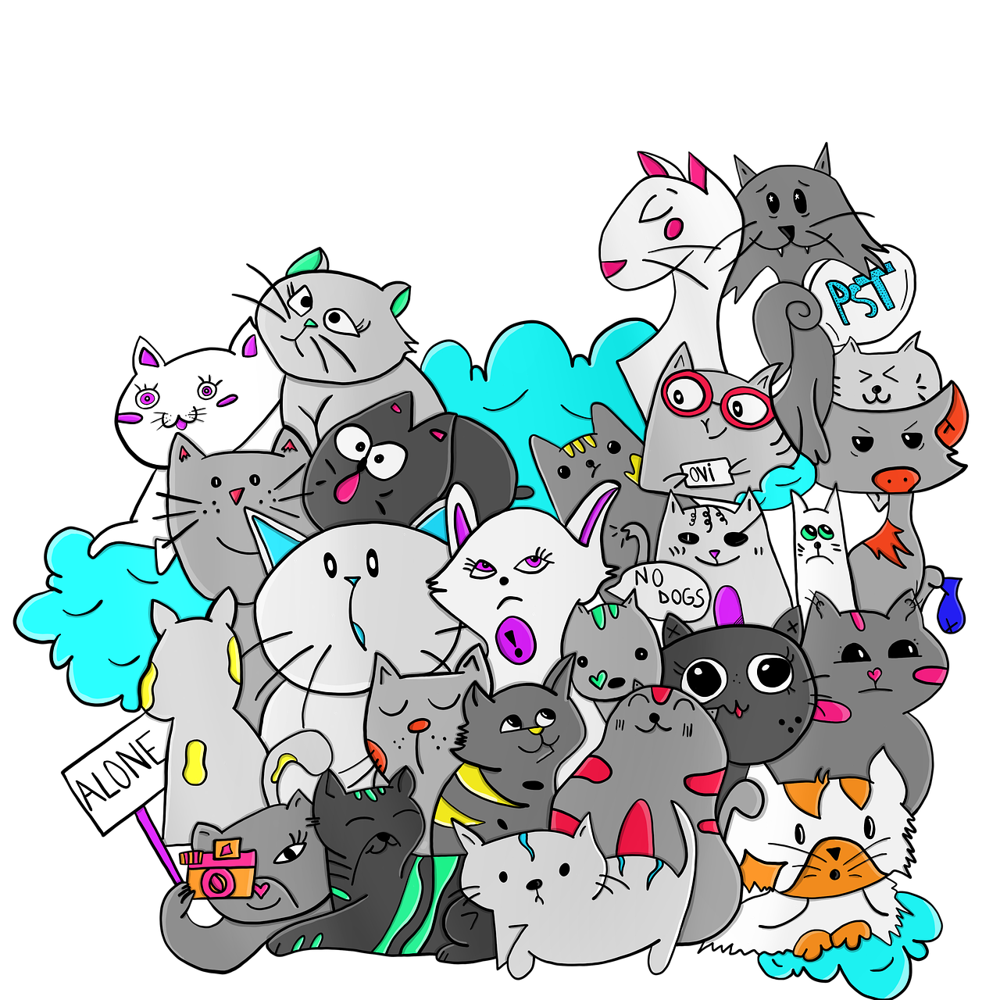
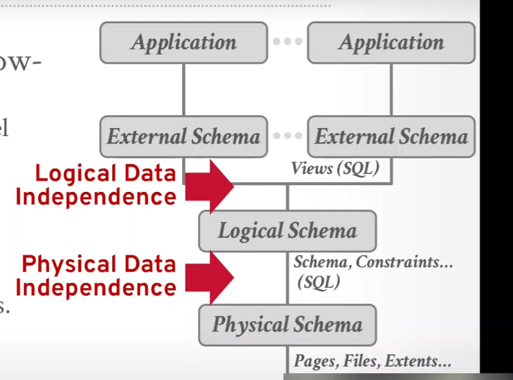
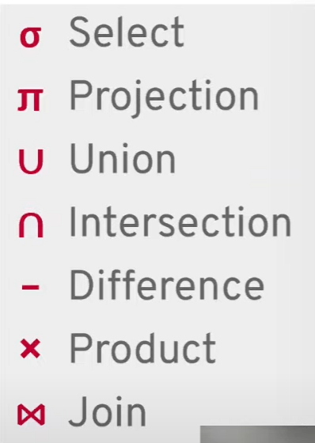
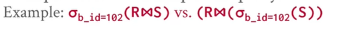
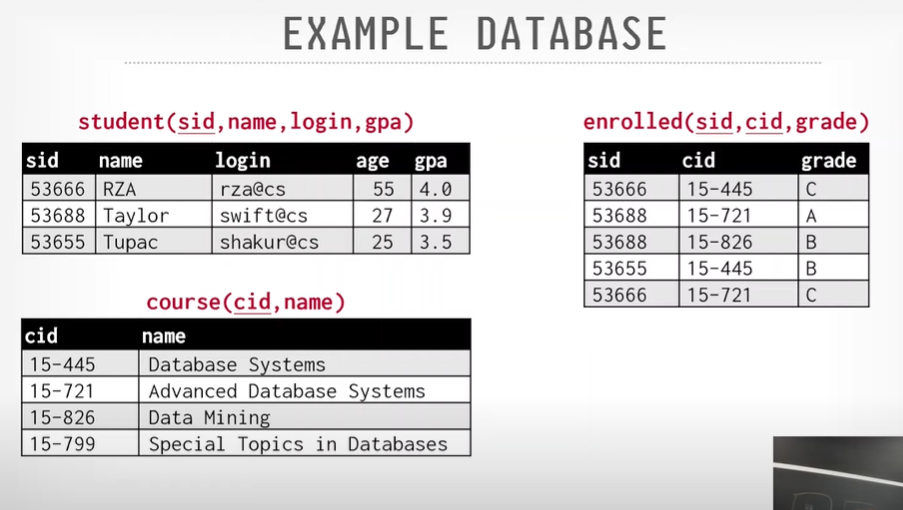
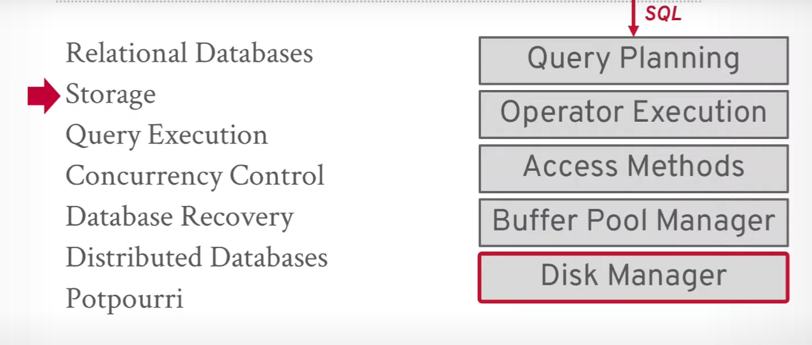
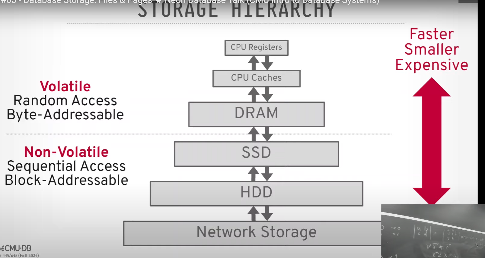
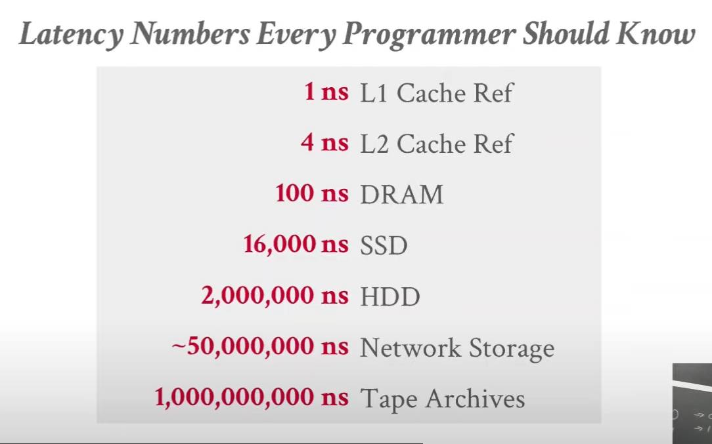
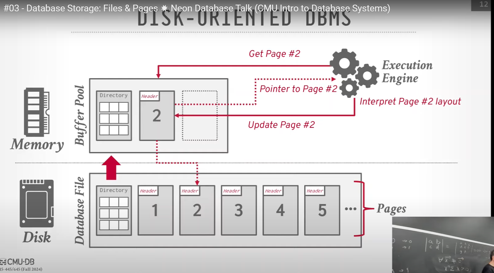

# Database System Advance
## Database Overview: Relational Model and Algebra

### What is a database?
  - Answer this your self! A database is a collection of data.

### What a database management system (DBMS) is?
  - A database management system (DBMS) is a software package designed to define, manipulate, retrieve and manage data in a database. 

### Data model
- A collection of concepts that can be used to describe the structure of a database.
  - Relational model
  - NoSQL model
  - Key-value model
  - Graph model
  - Wide-column model
  - Network model
- Schema: is a description of a particular collection of data, using the given data model.

### History of database system
  - 1970s: Relational model by Ted Codd at IBM in white paper
  - ...

### Relational Model
  - Relation model defines a database abstract based on the relations to avoid the complexity of the network and hierarchical model.
  - Store database in simple data structure
  - Physical storage is abstracted from the user, left up to the DBMS implementation
  - Access data through high-level query language, DBMS figures out the best execution strategy

  - **Structure, Integrity, and Manipulation of Data**
    - **Structure**: The definition of the database's relations and their content INDEPENDENT of their physical representation.
      - The user only worries about the high-level application logic
      - The DBMS figures out the best way to store and access the data
        
    - **Integrity**: Ensure the database's contents satisfy certain constraints.
    - **Manipulation**: The manipulation of a database refers to the way in which data is accessed, retrieved, and updated.

  - Keywords:
    - **Relation**: A table with columns and rows
    - **Tuple**: A row in a table
    - **Primary key**: A unique identifier for a tuple
    - **Foreign key**: A reference to a primary key in another table

### Data Manipulation Language (DML)
  - The API that a DBMS provides to allow users to access and manipulate data.
    - Procedural: Relational Algebra
    - Non-procedural: Relational Calculus

### Relation Algebra

  - A procedural query language, A set of operators that take relations as input and return relations as output
    
  

  - **Selection**: Selects a subset of rows from relation
  - **Projection**: Selects a subset of columns from relation
  - **Join**: Combines two relations by a common column
  - **Union**: Returns all tuples from two relations
  - **Difference**: Returns tuples in one relation but not the other
  - **Intersection**: Returns tuples in both relations
  - **Product**: Returns all possible combinations of tuples from two relations

  

### Queries
  - Relational algebra defines an order of the high-level steps to execute a query
  - A better approach is to state the high-level query and let the DBMS figure out the best way to execute it: SQL
  - The relational algebra is the foundation of the SQL language
  - The relation model is independent of any query language implementation

## Modern SQL

### SQL history
  - 1970s: SQL was developed at IBM by Donald D. Chamber: SQUARE > SEQUEL > SQL

### Example Database

### Aggregation FUNCTIONS
  - **COUNT**: Returns the number of rows
    - SELECT COUNT(*) FROM student WHERE login LIKE '%@cs';
  - **AVG**: Returns the average value of a column
    -     SELECT AVG(gpa) FROM student; 
    -     SELECT AVG(gpa), e.cid FROM enrolled e JOIN student s ON e.sid = s.sid GROUP BY e.cid;
    Filter result based on aggregate function
    -     SELECT AVG(gpa), e.cid FROM enrolled e JOIN student s ON e.sid = s.sid GROUP BY e.cid HAVING AVG(gpa) > 3.5;
  - **SUM**: Returns the sum of a column
  - **MIN**: Returns the minimum value of a column
  - **MAX**: Returns the maximum value of a column
### String Operations
  - **LIKE**: Pattern matching
    -     SELECT * FROM student WHERE login LIKE '%@cs';
  - **CONCAT**: Concatenates two strings
    -     SELECT CONCAT(firstname, ' ', lastname) FROM student;
  - **SUBSTRING**: Extracts a substring from a string
    -     SELECT SUBSTRING(login, 1, 3) FROM student;
  - **Concatenation**: Combines two strings
    -     SELECT firstname || ' ' || lastname FROM student;
### Date/time Operations
    - Get the number of days since the beginning of the year
      -     SELECT EXTRACT(DOY FROM CURRENT_DATE);

### Output Redirection
    - Redirect the output of a query to a file
      -     SELECT DISTINCT cid INTO TEMPORARY CourseId FROM enrolled WHERE cid LIKE 'CS%';

#### Window functions

- There is no notion of what is the position of a row in the result set in and how to get the first, second, or last row in the result set. 
- There is no concept of row numbers within an output. We can do order by to get the list of rows in an order, but within the sql query, we cannot refer to the first row, second row, or last row unless we use window functions.
- 
- **RANK**: Assigns a unique rank to each row within the partition of a result set.
-      SELECT ROW_NUMBER() OVER (PARTITION BY cid ORDER BY gpa DESC) AS row_num, * FROM enrolled;
- **ROW_NUMBER**: Assigns a unique sequential integer to each row within the partition of a result set.
  -         select * from (
                select *, Rank() over (partition by code order by  athletes_code desc ) as rank from teams
            ) as rank_table
            where rank_table.rank = 2

  

#### Nested Queries
- Invoking a query within another query
- Outer query: The query that contains the nested query
- Inner query: The query that is nested inside the outer query
- Nested queries can choke the performance of a database system, so use them judiciously. Better to use JOINs

#### JOINs
##### LATERAL JOIN
- A lateral join is a join that allows you to reference columns from the left table in the right table
      
        SELECT * FROM course c, 
          LATERAL (SELECT COUNT(*) as total_enrolled from enrolled e where e.cid = c.cid) as t1
          LATERAL (SELCT AVG(GPA) as avg_gpa from st where st.cid = c.cid) as t2;

##### LEFT JOIN
- A LEFT JOIN returns all records from the left table (table1), and the matched records from the right table (table2). The result is NULL from the right side if there is no match.
##### INNER JOIN
-  Generally faster because it only returns rows that have matching values in both tables.

#### Common Table Expressions (CTE)
- A CTE is a temporary result set that you can reference within a SELECT, INSERT, UPDATE, or DELETE statement.
- Alternative to nested queries, views and explicit temporary tables

        WITH cte AS (
          SELECT * FROM student
        )
        SELECT * FROM cte WHERE login LIKE '%@cs';

## Database Storage: Files & Pages

### Disk-based Architecture

- The DBMS assumes that the primary storage location of the database is on non-volatile disk
- The DBMS's components manage the movement of data between non-volatile disk and volatile storage (RAM)
- Volatile storage: RAM
  - Random Access Memory (RAM) is volatile storage
  - Data is lost when the power is turned off
  - Byte-addressable: Each byte of memory has a unique address, allowing for fast access
- Non-valatile storage: Disk
  - Disk storage is non-volatile: SSD, HDD, Network Storage
  - Data is retained when the power is turned off
  - Block-addressable: Data is stored in blocks, each block has a unique address, have to read the entire block to access the data
  - Slower than RAM

### Latency Numbers Every Programmer Should Know

Covert to human readable format: 
- **L1 cache reference**: 1 sec
- **L2 cache reference**: 4 sec
- **DRAM memory reference**: 100 sec
- **SSD storage**: 4.4 hours
- **HDD storage**: 3.3 weeks
- **Network**: 1.5 years
- **Tape Archives**: 31.7 years

What is CPU L1 and L2 cache?
  - The CPU has L1 and L2 cache to store frequently accessed data and instructions
  - The CPU can access data and instructions from the cache faster than from RAM

### Sequential vs Random Access
- Random access: Accessing data at an arbitrary location, until the data is found
- Sequential access: Accessing data in a linear order, from the beginning to the end, must faster

- Random access on non-volatile storage is slower than sequential access
- DBMS will want to maximize sequential access and minimize random access
  - Algo tru to reduce number of write to random pages sp that data is stored in contiguous blocks
  - Allocating multiple pages at the same time is called an extent.

### System Desigm Goals
- Allow the DBMS to manage databases that exceed the amount of memory available
- Reading/writing data to disk is expensive, so it must be managed carefully to avoid large stalls (panic) and performance degradation
- Random access is slow, so the DBMS will try to maximize sequential access
- 

#### Lecture 3: How the DBMS represent the database in files on disk
##### File storage: 
- The DBMS stores a database as one or more FILES on disk
- Each database files is in a specific format, with a specific structure, only the that DBMS can understand (mysql can only read mysql files)
- The OS does not know anything about the contents of these files, only the DBMS does
##### Storage manager:
- The storage manager is responsible for maintaining the database files on disk
- It's organized files as a collection of PAGES
- Does not maintain multiple copies of a page on disk
##### Database Page:
- A page is a fixed-size block of data
  - IT can contain tuples, medadata, indexes, logs
  - do not mix page types in a single page
  - page is a self-contained: everything needed to manage the data in the page is in the page, this is essential for **crash recovery.**
- Each page has a unique page ID
  - the dbms uses an indirection layer to map page IDs to physical locations on disk
- There are 3 different notions of "pages" in DBMS:
  - Hardware page: is the largest block of data that the storage device can guarantee failsafe wires (4kb)
  - OS page: (4kb, x64 2MB/1GB)
  - Database page: on top of OS page, and on top of hardware page (512B-32KB), DBMSs that specialize in read-only workloads may use larger pages to reduce the overhead of managing pages

