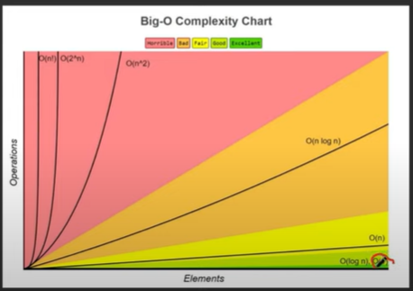
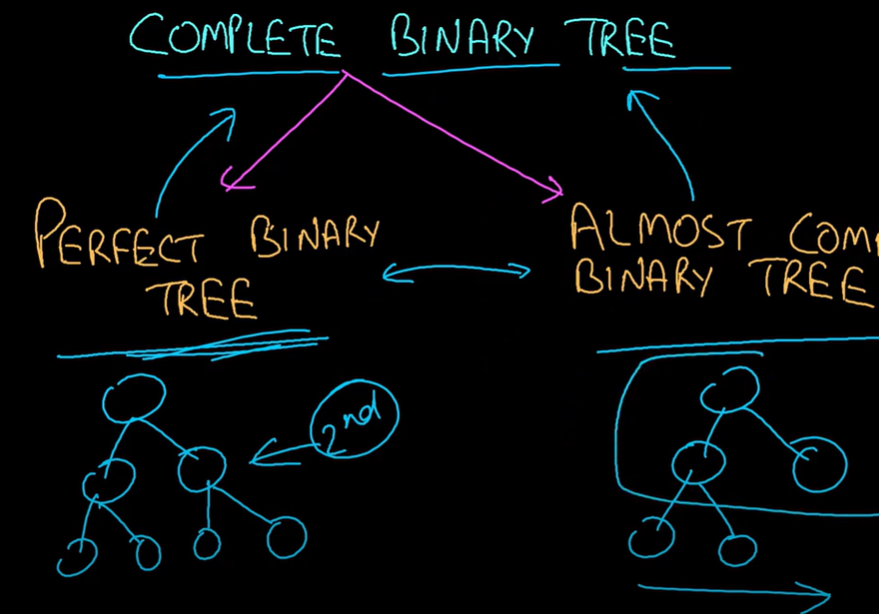

# Resume
My resume is available for download:
[Golang_Pham_Xuan_Thang.pdf](CMCGlobal_Golang_Pham_Xuan_Thang.pdf)


# Interview Preparation
To help you prepare for the interview based on the job description and your feedback on the interview process, I’ll structure a simulated interview with three rounds:
1. Technical Coding Round
2. System Design & Architecture
3. Behavioral & Experience Discussion

Each round will focus on the relevant skills outlined in the job description and align with what you’ve shared about the interview expectations. I’ll also include some potential questions and scenarios based on the interview feedback you provided.

## Round 1: Technical Coding Challenge (45 minutes)

This round focuses on problem-solving, coding proficiency, and algorithmic thinking. You’ll work on a live coding exercise using a codeshare link provided by the interviewer.

### Coding Questions:
**K-th Largest Element in an Array**
  - **Prompt**: Given an unsorted array, find the K-th largest element.
  - **Approach**: Mention using a min-heap (binary heap) of size K. Explain why this approach is efficient (O(N log K) complexity).
  - **Follow-up**: Discuss potential edge cases and optimizations.

**Two Sum**
  - **Prompt**: Given an array of integers `nums` and an integer `target`, return the indices of the two numbers that add up to `target`.
  - **Approach**: Start with a hash map solution for O(N) time complexity.

**Find Middle of a Linked List**
  - **Prompt**: Given a singly linked list, find its middle node. If the list has an even number of nodes, return the second middle node.
  - **Approach**: Use the two-pointer technique for optimal O(N) time complexity.

### Things to Keep in Mind:
- Aim for the most efficient solution possible without overthinking.
- Communicate concisely: The interviewer prefers seeing a solution rather than hearing an extended explanation unless prompted.
- Manage your time effectively, as they might ask up to 3 coding questions.

## Round 2: System Design & Architecture (60 minutes)

This round evaluates your understanding of system design, scalability, and handling edge cases. It will include high-level design questions and potentially require designing on a virtual whiteboard or document.

### Questions:
**Design a Payment System**
  - **Objective**: Design a payment flow that can handle multiple transactions simultaneously.
  - **Considerations**:
    - **Scalability**: How would you handle a high volume of concurrent transactions?
    - **Error Handling**: Implement retries, timeouts, and failure recovery mechanisms.
    - **Security**: Discuss how to secure transactions (e.g., encryption, tokenization).
    - **Logging & Monitoring**: How would you set up alerts and logs for real-time issues?
    - **Tech Stack**: Consider using microservices, queues, and database transactions. Mention using cloud services like AWS for scalability.

**Rate Limiter Design**
  - **Objective**: Design a rate-limiting mechanism to prevent abuse of an API.
  - **Data Structures**: You could use a hash map with sliding window counters or a leaky bucket algorithm.
  - **Considerations**:
    - Handling burst traffic and deciding on a rate-limiting strategy.
    - Trade-offs between memory usage and performance.
    - Scaling the solution to a distributed system.

### Tips:
- Focus on outlining the key components of your design first before diving into specifics.
- Use the STAR method (Situation, Task, Action, Result) when explaining your approach.
- Be prepared to discuss trade-offs and why you chose a particular solution.

## Round 3: Behavioral & Experience Interview (30 minutes)

This round focuses on your past experience, problem-solving approaches, and fit within the team culture. Expect questions related to the technologies mentioned in the job description, as well as some general questions about your experience.

### Questions:
**Experience Discussion**:
  - Describe your experience with Golang and building microservices.
  - Can you share a challenging project you worked on that involved PostgreSQL/MySQL?
  - Walk us through a time when you optimized an application’s performance.
  - Share an example of when you had to handle API integration or resolve a tricky bug in production.

**DevOps & CI/CD**:
  - What experience do you have with Docker, Kubernetes, and setting up CI/CD pipelines?
  - How would you ensure that your code is maintainable and scalable?

**Agile Practices**:
  - Can you discuss your experience working in an Agile environment?
  - How do you handle changing priorities or unexpected changes in project requirements?

**Testing & Code Quality**:
  - What kind of unit tests, integration tests, and end-to-end tests have you implemented in your projects?
  - How do you ensure code quality in a team environment?

### Preparation Tips:
- Be ready to discuss how your experience aligns with the job requirements.
- Have examples of past projects where you demonstrated the key skills mentioned in the job description.
- Practice answering questions concisely but with enough detail to show your expertise.

## Additional Preparation Resources

- **Coding practice**: LeetCode, HackerRank (focus on array, linked list, and heap problems).
- **System design**: Watch YouTube videos on payment flow systems, rate limiters, and scalable microservices.
- **Brush up on Golang fundamentals and cloud infrastructure like AWS/GCP.

# Script for Mock Interview

## Introduction

> **Interviewer**: Can you please introduce yourself and give us a brief overview of your professional background?
> 
> **You**: "Hello,
> my name is \[Your Name\]. I have over 5 years of professional experience in software development, specializing in backend development with Golang. I have successfully led a team of 5 to develop, maintain, and optimize applications. My expertise includes building RESTful APIs, microservices, and managing databases such as PostgreSQL, Redis, MongoDB, and Dgraph.
> 
> Additionally, I have experience in full-stack integration, ensuring smooth functionality between frontend and backend components. I have implemented various testing frameworks and tools to ensure application reliability and performance. I am also familiar with DevOps practices, including CI/CD pipelines, Docker, and Kubernetes, and have experience with cloud platforms like AWS.
>
> Besides my technical skills, I enjoy teaching and mentoring. I also work as a freelance developer in my free time, handling requirements, task breakdowns, cost estimation, hiring, team management, and project delivery.
## Technical Coding Round

### Question 1: K-th Largest Element in an Array

> **Interviewer:** Given an unsorted array, find the K-th largest element.
>
> **You:**
> "To solve this problem, I would use a min-heap of size K. This approach is efficient with a time complexity of O(N log K). Here is a sample implementation in Golang:"
    

```go
package main

import (
	"container/heap"
	"fmt"
)

func findKthLargest(nums []int, k int) int {
	h := &IntHeap{}
	heap.Init(h)
	for _, num := range nums {
		heap.Push(h, num)
		if h.Len() > k {
			heap.Pop(h)
		}
	}
	return heap.Pop(h).(int)
}

type IntHeap []int

func (h IntHeap) Len() int           { return len(h) }
func (h IntHeap) Less(i, j int) bool { return h[i] < h[j] }
func (h IntHeap) Swap(i, j int)      { h[i], h[j] = h[j], h[i] }
func (h *IntHeap) Push(x interface{}) {
	*h = append(*h, x.(int))
}
func (h *IntHeap) Pop() interface{} {
	old := *h
	n := len(old)
	x := old[n-1]
	*h = old[0 : n-1]
	return x
}

func main() {
	nums := []int{3, 2, 1, 5, 6, 4}
	k := 2
	fmt.Println(findKthLargest(nums, k)) // Output: 5
}
```

### Question 2: Two Sum

> *Interviewer:** Given an array of integers `nums` and an integer `target`, return the indices of the two numbers that add up to `target`.
>
> **You:**
>"I would use a hash map to solve this problem in O(N) time complexity. Here is a sample implementation in Golang:"

```go
package main

import "fmt"

func twoSum(nums []int, target int) []int {
	m := make(map[int]int)
	for i, num := range nums {
		if j, ok := m[target-num]; ok {
			return []int{j, i}
		}
		m[num] = i
	}
	return nil
}

func main() {
	nums := []int{2, 7, 11, 15}
	target := 9
	fmt.Println(twoSum(nums, target)) // Output: [0, 1]
}
```

### Question 3: Find Middle of a Linked List

> **Interviewer:** Given a singly linked list, find its middle node. If the list has an even number of nodes, return the second middle node.
>
> **You:**
> "I would use the two-pointer technique to solve this problem in O(N) time complexity. Here is a sample implementation in Golang:"

```go
package main

import "fmt"

type ListNode struct {
	Val  int
	Next *ListNode
}

func middleNode(head *ListNode) *ListNode {
	slow, fast := head, head
	for fast != nil && fast.Next != nil {
		slow = slow.Next
		fast = fast.Next.Next
	}
	return slow
}

func main() {
	head := &ListNode{1, &ListNode{2, &ListNode{3, &ListNode{4, &ListNode{5, nil}}}}}
	fmt.Println(middleNode(head).Val) // Output: 3
}
```

## System Design & Architecture

### Question 1: Design a Payment System

> **Interviewer:** Design a payment flow that can handle multiple transactions simultaneously.
> 
> **You:**
> "Before deciding on the design, I have a few questions to better understand the requirements:
> 
> **Functional requirements**: 
> 
> What kind of payment system are we building?
>   - Customer -> Merchant -> Payment Service -> Payment Service Provider(payment gateway, bank) -> Merchant
> 
> Main features:
>   - Get balance, make payment
>   - Handle payment using a payment service provider
> 
> Main components:
>   - Payment service: coordinate payment flow, interact with PSP
>   - Wallet: manage user balances (view)
>   - Ledger: record transactions (reconciliation)
> 
> **Non-functional requirements**:
> 
> Reliability, Fault-tolerance, Scalability, Security
> 
> How should the system handle failures and inappropriate payments?
>    - Implement retries, timeouts, and fallbacks to guarantee transaction completion
>    - Implement dead-letter queues for failed transactions
>    - Implement Idempotency to prevent duplicate payments
> 
> What security measures need to be implemented?
>    - Encrypt data at rest (database) and in transit (API)
>    - Access control
> 
> Some of the base estimates:
>    - DAU: 1M
>    - Transactions per day: 1M
>    - Peak traffic: 10K TPS
>    - 3000 concurrent requests
>    - 2500 reads + 500 writes
>    - how many transactions per second? 1000 TPS

#### Functional requirements:
   - Handle payment using a payment service provider (handle payment gateway, risk check, bank, etc.)
   - Wallet & ledger

#### Non-functional requirements:
   - 3000 concurrent requests
   - 2500 reads + 500 writes
   - Encryption, tokenization
   - Low cost
   - Database only have max 250 open connections

1. **Scalability:** Use microservices and message queues to handle high volumes of transactions.
2. **Error Handling:** Implement retries, timeouts, and failure recovery mechanisms.
3. **Security:** Use encryption and tokenization to secure transactions.
4. **Logging & Monitoring:** Set up alerts and logs using tools like Grafana and Prometheus.
5. **Tech Stack:** Use AWS for scalability, Docker for containerization, and Kubernetes for orchestration.
### Question 2: Rate Limiter Design

> **Interviewer:** Design a rate-limiting mechanism to prevent abuse of an API.
> 
> **You:**
> "I would use a sliding window counter or a leaky bucket algorithm to implement rate limiting. Here is a high-level design:"
 
1. **Data Structures:** Use a hash map with sliding window counters.
2. **Handling Burst Traffic:** Implement a rate-limiting strategy to handle burst traffic.
3. **Trade-offs:** Balance memory usage and performance.
4. **Scaling:** Use distributed systems to scale the solution.

## Behavioral & Experience Interview

### Experience Discussion

> **Interviewer:** Describe your experience with Golang and building microservices.
> 
> **You:**
> "I have extensive experience with Golang, having worked on various projects where I built microservices using frameworks like Gin, Beego, and Echo. I have implemented RESTful APIs, handled concurrency, and optimized performance."

> **Interviewer:** Can you share a challenging project you worked on that involved PostgreSQL/MySQL?
> 
> **You:**
> "At FPT Software, I worked on a project where we had to migrate a large PostgreSQL database to a new schema. The challenge was to ensure data integrity and minimal downtime. I wrote scripts to automate the migration process and used tools like pg_dump and pg_restore."

> **Interviewer:** Walk us through a time when you optimized an application’s performance.
> 
> **You:**
> "At Jamalex Startup Studio, I optimized a Golang application by identifying performance bottlenecks using profiling tools. I refactored the code to use more efficient algorithms and leveraged concurrency to improve throughput."

> **Interviewer:** Share an example of when you had to handle API integration or resolve a tricky bug in production.
> 
> **You:**
> "At NexOFF LLC, I integrated a third-party payment API into our system. During testing, I encountered a bug where transactions were failing intermittently. I debugged the issue by analyzing logs and found that it was due to a race condition. I resolved it by implementing proper synchronization mechanisms."

### DevOps & CI/CD

> **Interviewer:** What experience do you have with Docker, Kubernetes, and setting up CI/CD pipelines?
> 
> **You:**
> "I have extensive experience with Docker and Kubernetes, having used them to containerize applications and manage deployments. I have set up CI/CD pipelines using GitLab CI and GitHub Workflow to automate the build, test, and deployment processes."

> **Interviewer:** How would you ensure that your code is maintainable and scalable?
> 
> **You:**
> "I follow best practices such as writing clean, modular code, adhering to SOLID principles, and conducting code reviews. I also write unit tests and integration tests to ensure code quality and maintainability."

### Agile Practices

> **Interviewer:** Can you discuss your experience working in an Agile environment?
> 
> **You:**
> "I have worked in Agile environments where we followed Scrum practices. We had regular sprint planning, daily stand-ups, and retrospectives. This helped us stay on track and adapt to changing requirements."
> 
> **Interviewer:** How do you handle changing priorities or unexpected changes in project requirements?
> 
> **You:**
> "I prioritize tasks based on their impact and urgency. I communicate with stakeholders to understand the changes and adjust the project plan accordingly. I also ensure that the team is aware of the changes and aligned with the new priorities."

### Testing & Code Quality

> **Interviewer:** What kind of unit tests, integration tests, and end-to-end tests have you implemented in your projects?
> 
> **You:**
> "I have implemented unit tests using testing frameworks like Go's built-in testing package and Jest for JavaScript. I have written integration tests to test interactions between different components and end-to-end tests to ensure the entire application works as expected."
> 
> **Interviewer:** How do you ensure code quality in a team environment?
> 
> **You:**
> "I ensure code quality by conducting code reviews, following coding standards, and using static code analysis tools. I also encourage the team to write tests and document their code."

## My Note 


### Coding Questions
#### Need to understand how to calculate the time complexity of the solution.

- Time complexity: 
  - Time complexity is a measure of the amount of time an algorithm takes to run as a function of the length of the input.
  - It describes the number of operations an algorithm performs to complete its task.
  - It is usually expressed using Big O notation.

- Space complexity: 
  - Space complexity is a measure of the amount of memory an algorithm uses as a function of the length of the input.
  - It describes the amount of memory required by the algorithm to complete its task.
  - It is also expressed using Big O notation.
  

## Understand different data structure:

### Linked List:
- Pros: Dynamic size, efficient insertions and deletions

### Hash Map:
- Pros: Fast lookups, key-value storage

### Heap:
- Pros: Efficiently find the smallest/largest element, priority queue operations

- Cons: Slower insertions and deletions compared to arrays 

- Power of heap:
  - Find the smallest/largest element in O(1) time
  - Insert an element in O(log N) time
  - Remove the smallest/largest element in O(log N) time
  - Search for an element in O(N) time

- Concept of Heap:
  - Tree-based data structure
  - A heap is a complete binary tree (completely filled except possibly for the bottom level, which is filled from left to right)
  - Two types of heaps: min-heap and max-heap
      - In a min-heap, the parent node is smaller than its children
      - In a max-heap, the parent node is larger than its children

- Representing a heap:
  - Array-based representation
  - Parent node at index <code>i</code>:
    - Left child at index <code>2i + 1</code>
    - Right child at index <code>2i + 2</code>
  - Child node at index <code>i</code>:
    - Parent node at index <code>(i - 1) / 2</code>
  - Height of a heap <code>h = log N</code>
  - Max node at height <code>h = 2^h</code>
  - Max node in a heap of height <code>2^{(h+1)} - 1</code> = max size array
  - Range of leaves in a heap: <code>N / 2</code> to <code>N - 1</code>
  - Range of internal nodes in a heap: 0 to <code>(N / 2) - 1</code>
  - Range of the entire heap: 0 to <code>N / 2 -1 </code> and <code>N / 2</code> to <code>N - 1</code>
  - Max-heap have the element in the array in descending order
  - Min-heap have the element in the array in ascending order

- Heapify Algorithm:
  - Heapify is the process of converting an array into a heap.
  - The process involves starting from the last non-leaf node and moving up the tree recursively.
  - Only able to heapify the internal nodes, not the leaves and all the leaves are already heapify.
  
## K-th Largest Element in an Array

- My first normal simple solution for this:
  - Sort the array in descending order and then Get the K-th element from the sorted array. 1st -> index 0, 2nd -> index 1, ..., K-th -> index K-1
  - The time complexity of this solution is O(N log N) due to sorting the array.
  - The space complexity is O(1) as we are not using any extra space.
- Second solution:
  - Use a min-heap of size K to store the K largest elements.
  - Traverse the array and add elements to the heap.
  - If the heap size exceeds K, remove the smallest element from the heap.
  - The top element of the heap will be the K-th largest element.
  - The time complexity of this solution is O(N log K) due to inserting N elements into the heap.
  - The space complexity is O(K) for the heap.
  
