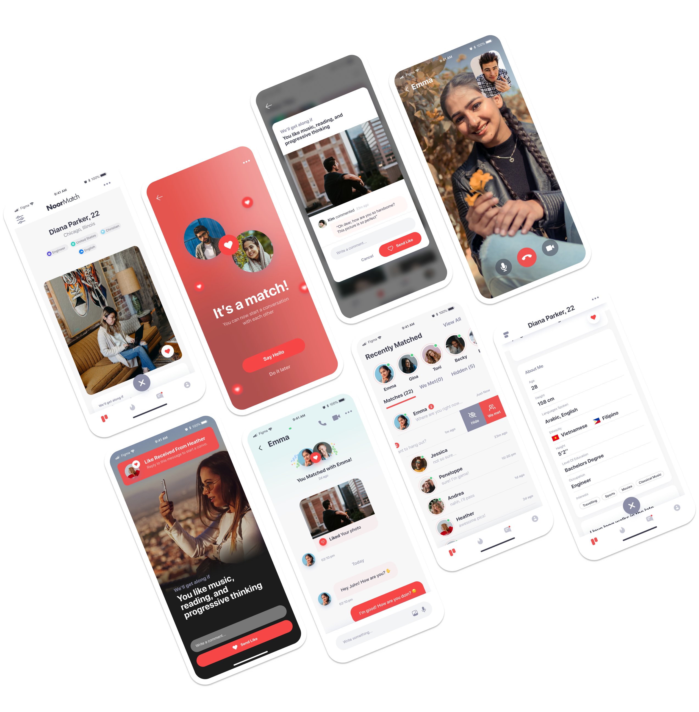

## Project Summary

The Joon project was initiated to address the need for a Muslim marriage app that provides a safe and secure platform for single Muslims to connect with each other for the purpose of marriage. The app was designed to facilitate halal conversations and interactions between users, while ensuring privacy and security.

### Key Features

- User registration and authentication system
- Messaging and communication between users
- User profile customization
- Recommendation system
- Chat system for users
- Real-time notifications
- Admin panel for managing users and content
- AI auto verification profiles

### Project Team

The Joon project was developed by a team of 5 software engineers:

- Team Lead: Thắng Phạm 
- Business Analyst
- Front-end Developer
- Back-end Developer
- Devops
- Tester

The team worked collaboratively to design, develop, and deploy the Joon project.

## Technologies Used

This project utilizes a variety of technologies to deliver a robust and scalable solution:

### Front-end:
- **ReactJS**: Used for building the dashboard and web interfaces, ReactJS allows us to build complex user interfaces from isolated pieces of code called "components".
- **Flutter**: Used for mobile application development. It's a UI toolkit that allows us to natively compile applications for mobile, web, and desktop from a single codebase.

### Back-end:
- **Golang**: The backend service is written in Golang, which provides excellent performance and simplicity.
- **Python**: For the AI auto verification profiles and recommendation system.

### Database:
- **PostgreSQL**: This is our primary relational database, known for its reliability and robustness.
- **Redis**: Used as an in-memory data structure store, used as a database, cache, and message broker.
- **Dgraph**: Used for providing recommendation systems, leveraging its graph database capabilities.

### Others:
- **Asynq**: This is our message queue of choice, providing reliable asynchronous task processing.
- **Prometheus**: Used for event monitoring and alerting.
- **Loki**: Integrated with Prometheus, Loki is used for centralized logging.
- **Kuma-Uptime**: Used for monitoring the uptime of our services.
- **Kubernetes (k8s)**: Used for automating deployment, scaling, and management of containerized applications.

### Project Duration

The Joon project was developed over a period of 2 years, starting from March 2020

### Project Outcome

The Joon project successfully launched in September 2020 and has gained a growing user base since then. It has received positive feedback for its user-friendly interface and the ability to connect like-minded individuals.

For more details about the project, please visit the [Joon Page](https://myjoon.app/).