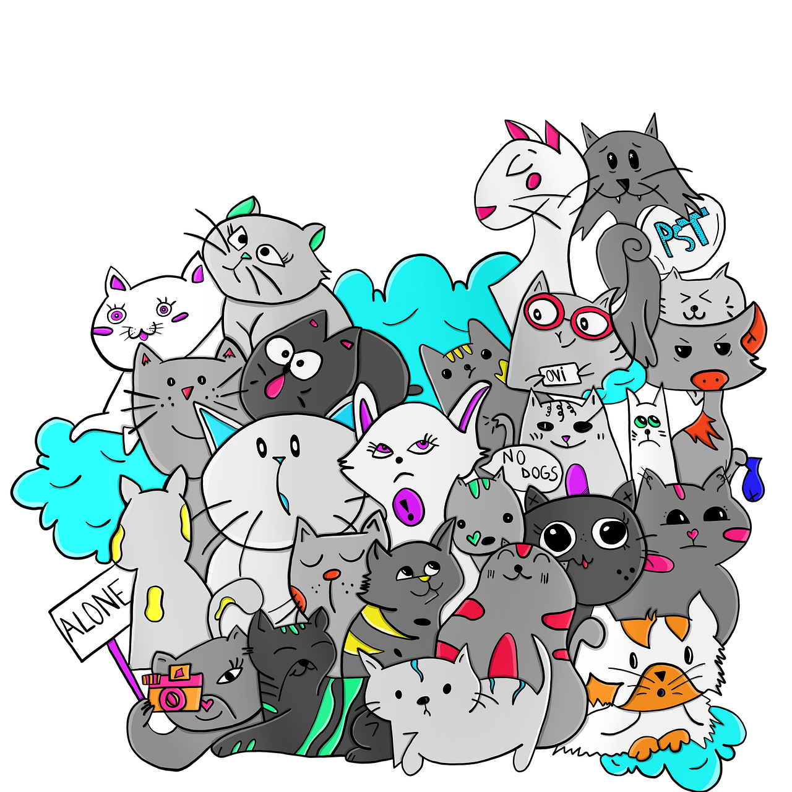

# PHP course for wordpress developer

### What is php, how it works?

- php is a server side language, it is used to create dynamic web pages. 
- how it excutes the code? php code is executed on the server, and the result is returned to the browser as plain html.

### How php interacts with wordpress?

