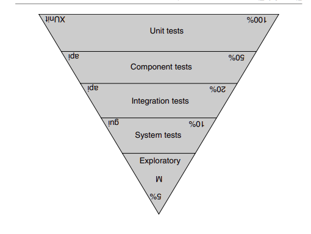

# The clean coder

## Introduction

 As a developer, I'm excited to share my experiences, challenges, and learnings with you. In this first blog post, I will discuss how I am preparing my knowledge on how to become a professional developer

## The story

The idea for becoming a professional coder came to me while I was reading the book Clean Coder by Robert C. Martin. He explains his expectation for a professional programmer on management **interactions**, **time management**, **pressure**, on **collaboration**, and on the **choice of tools to use**. The book inspired me to become a better developer, let's begin with the concepts.

I will sum up everything in the book for you to understand the key points and how to apply them in your daily work.

### Taking responsibility
    
Great power comes with great responsibility, professionalism is all about taking responsibility. So how do we take responsibility? There are some principles:
- **Do no harm to the function**: We harm the function of our software when we create bugs. Therefore, in order
  to be professional, we must not create bugs. I know  It won’t ever get to zero, but it is your responsibility to get as close as possible to it
- **QA Should Find Nothing**: If you are a professional, you should know that your code works. You should have all the tests in place to prove it
- **Do no harm to structure**: Why do most developers fear to make continuous changes to their code? They are afraid they’ll break it! Why are they afraid they’ll break it? Because they don’t have tests.
- **Work ethic**:Learning is your responsibility, not your employer and professionals spend time caring for their profession

### Must Know your field

“Those who cannot remember the past are condemned to repeat it.”

    - Do you know what a Nassi-Schneiderman chart is?

    - The difference between a Mealy and a Moore state machine

    - Do you know what the term “Transform Analysis” means?

    - Could you perform a functional decomposition with Data Flow Diagrams?

    - What does the term “Tramp Data” mean?

    - Have you heard the term “Conascence”?

    - What is a Parnas Table?

    - Design patterns. You ought to be able to describe all 24 patterns in the GOF book and have a working knowledge of many of the patterns in the POSA books.

    - Design principles. You should know the SOLID principles and have a good understanding of the component principles

    - Methods. You should understand XP, Scrum, Lean, Kanban, Waterfall, Structured Analysis, and Structured Design

    - Disciplines. You should practice TDD, Object-Oriented design, Structured Programming, Continuous Integration, and Pair Programming.

    - Artifacts: You should know how to use: UML, DFDs, Structure Charts, Petri Nets, State Transition Diagrams and Tables, flow charts, and decision tables

#### Continous learning

#### Practice
-  Practice is when you 
specifically exercise your skills outside of the performance of your job for the 
sole purpose of refining and enhancing those skills

#### Collaboration

#### Mentoring

#### Know your domain
- If you are writing an accounting system, 
you should know the accounting field.
- If you are writing a travel application, 
you should know the travel industry.

#### Identify your boss

- It’s easy to fall into an us versus them attitude with your employer. Professionals avoid this at all costs.

#### Humility
- Just Laugh when you can


## Saying No

#### Adversarial Roles

“Do; or do not. There is no trying.” 

Negotiation for the best possible out come, protect your benefit:

Dont just say let me try, 

The conversation was a bit adversarial, and there were a few uncomfortable moments, but that’s to be expected when two people assertively pursue goals that aren’t in perfect alignment

#### High Stake

The most important time to say no is when the stakes are highest. The higher 
the stakes, the more valuable no becomes

        Don: “There’s nothing I can do Chuck. We’ve been through this already. 
        Galitron won’t cut scope, and they won’t accept any interim 
        releases. They want to do the installation once and be done with 
        it. I simply cannot do that any faster. It’s not going to happen.”

        Charles: “Damn. I don’t suppose it would matter if I told you your job 
        was at stake.”

        Don: “Firing me isn’t going to change the estimate, Charles.”

        Charles: “We’re done here. Go back to your team and keep this project 
        moving. I’ve got some very tough phone calls to make.”

#### Being a "team player"

A team-player communicates frequently, keeps an eye out for his or her teammates, and executes his or her own responsibilities as well as possible

A team player is not someone who says yes all the time.

Defend the team, know what could, and could not, dont just just lied through teeth to just being good in somebody eyes. 

#### TRYING

THERE IS NO TRYING, JUST DO OR NOT

#### Passive aggression

When a freight train is bearing down on you and you are the only one who can 
see it, you can either step quietly off the track and watch everyone else get run 
over, or you can yell “Train! Get off the track!”

Record evidents in every convo, direct to the one have higher power, be professional and polite.

#### The cost of saying Yes

“Is good code impossible? Is professionalism impossible?”

Answer: I say no.


## Saying Yes

#### Language of commitment

Say. Mean. Do.

Lack of commitment:

-  “We need to get this done.” “I need to lose weight.” “Someone 
should make that happen.”
- “I hope to get this done by tomorrow.” “I hope we can meet 
again some day.” “I wish I had time for that.” “I wish this computer was 
faster.”
- “Let’s meet sometime.” “Let’s finish this thing.”

Commitment:

- I will .... by < time >

    You’re stating a fact about something YOU will do with a clear end time

    You’re taking full responsibility for something, in front of an audience of at least one person. 

    I will read the book everyday and finish by 15/6 

But you can commit to specific actions that will bring you to your target.

If the end goal depends on someone else, you should commit to specific actions that bring you closer to the end goal.

If you can’t make your commitment, the most important thing is to raise a red flag as soon as possible to whoever you committed to. I there always another plan to able to commit to

If you don’t tell anyone about the potential problem as soon as possible, you’re not giving anyone a chance to help you follow through on your commitment.

#### Learning how to say YES

- use maybe if uncertain
- ALWAYS commit with discpline: 

    He might be able to get 
done faster if he doesn’t write his tests. He might be able to get done faster if he 
doesn’t refactor. He might be able to get done faster if he doesn’t run the full 
regression suite --> NO, NEVER, 

As a professional, has already made a commitment to maintain these standards.

```
Peter: “OK, Marge, I’ll tell you what. I’ll call home and clear some overtime with my family. If they are OK with it, then I’ll get this task done by Monday morning. I’ll even come in on Monday 
morning to make sure everything goes smoothly with Willy. But then I’ll go home and won’t be back until Wednesday. Deal?”
```

Saying yes but clear of the effort, cost


#### Conclusion
Professionals are not required to say yes to everything that is asked of them. 
However, they should work hard to find creative ways to make “yes” possible. 
When professionals say yes, they use the language of commitment so that there 
is no doubt about what they’ve promised.


## Coding

#### Coding is hard

If you are tired or distracted, do not code. You’ll only wind up redoing what you 
did. Instead, find a way to eliminate the distractions and settle your mind

#### 3 A.M Code

Don’t write code when you are tired. Dedication and 
professionalism are more about discipline than hours. Make sure that your sleep, 
health, and lifestyle are tuned so that you can put in eight good hours per day.

#### Worry Code

Peace your mind before contranting on coding, it is better to spend an hour quieting the personal issues than to use brute force to write code that you’ll just have to throw away later *(or worse, live with).*

#### The Flow Zone
The Zone is not where you want to be.

Code written in the Zone may come out faster, but you’ll be going back to visit it more.

#### Interruptions

There will be interruptions that distract you and cause you 
to lose time. 

When they happen, remember that next time you may be the one who needs to interrupt someone else. So the professional attitude is a polite willingness to be helpful

#### Block

Sometime code refuses to appear. Just dont fight it, trying to relax and come later after some amout of time. Or better to fight a pair partner

#### Creative Input

Creative output depends on creative input. Be happy, relax and creative when start thinking to code, that's when best output comes

#### Debugging

Debugging time is just as expensive to the business as coding 
time is, and therefore anything we can do to avoid or diminish it is good.

Doctors don’t like to reopen patients to fix something they did wrong. Lawyers don’t like to retry cases that they flubbed up. Likewise, a software developer who creates many bugs and needed large debugging time is acting unprofessionally


#### Pacing yourself

Know whne to walk away, when you are stuck, when you are tired, disengage for awhile. Pace yourself, and your team. Dont just run as fast as you can

Driving time might solve the problems. There is something about disengagement that allows your mind to hunt for solutions in a different and more creative way.

Sometimes the best way to solve a problem is to go home, eat dinner, watch TV, go to bed, and then wake up the next morning and take a shower

#### Hope

Do not incorporate hope into your estimates!

Do not hope that you can get it all done in ten days! Hope is the project killer. Hope destroys schedules and ruins. Don’t 
let anyone else have hope.

#### Rushing
Hold to your original estimates! Do not be tempted to rush. There is no way to rush. So you must answer your boss, your team, and your stakeholders by depriving them of hope.

#### Overtime

Dhould not agree to work overtime unless:
 
(1) you can personally afford it

(2) it is short term, two weeks or less 

(3 - Dealbreaker) your boss has a fall-back plan in case the overtime effort fails

#### False delivery

The worst of all unprofessinal is saying you are done when you know you aren’t

You avoid the problem of false delivery by creating an independent definition of “done.” - have your BA and Tester create automated acceptance tests.

#### Helping others and getting help

We didn’t get into this business because we 
like people.

You will likely come away having learned more than you gave

Since for many of us collaboration 
is not an instinct, we require disciplines that drive us to collaborate.

#### Mentoring

It is a matter of professional ethics for senior programmers to spend time taking younger programmers under their wing and mentoring them

## Test Driven Development

But first I need to say this:

- The jury is in!

- The controversy is over.

- **And TDD works.**


#### THE THREE RULES: 

Learn the skill externally - will take months

1. You are not allowed to write any production code until you have first written a failing unit test.

2. You are not allowed to write more of a unit test than is sufficient to fail—and not compiling is failing.

3. You are not allowed to write more production code that is sufficient to pass the currently failing unit test

*Note*:
- If you found the solution for the production code is wrong, dont just fix the production code, write another unit test to prove that solution is wrong

- Dont rush for the goal, trying to cover all the case around the final case

- Avoid testing implementaion details, test behaviors

- Write a test -> Make it compile -> Run it to see that it fails -> Make it run -> Remove duplication

- Just make it run and pass, being sinful, write sinful code

- Refactoring step is when we preoduce clean code

- Do not write new unit test when you refactoring code

- Avoid heavyly mocking

- Test behavios not implementation

- Dont test internals

- Sometimes unit test only for you understand what are you doing, after that, delete that test after to avoid burden for ohters

- TTD pattern is to ensure us to able to refactoring the code, make our code be more clean are professional, but if we have the wrong implementation of TDD, making too much unit test with too many dependencies/mocking/coupling that would prevent us from refactoring. What happend when you refactoring the got 300 failed test cases? You will **Ctrl-Z**!


- Developers write developer tests; not unit test (unit test have a different definition with what are we doing with TDD)

- Refactoring: change internal structure without changing it observable behavior.

- TTD is contract first; that means you should only test what your code exposes to other callers. So that you can change your code's detail implementation without changing the test

- Test should be coupled to the behavior of code and decoupled from the structure code. So best scenerio is that when refactoring code, should not any test changing for failed.

- Avoid as much mock as in a test

- Call it's Developer Test instead of Unit Test

- TTD is all about slowly discovery the solution, dont step too fast, the failure of a test case implicates only the developer's most recent edit.

- Mocks, avoid mock when develop the solution.

- write TTD == implementing the requirement

- DO NOT write new tests if you introduce new methods when refactoring to clean code

- Writing developer test, implement TTD in a way that it is very importance that even stake holder able to understand or they can have a look a belevie that behavior is working correctly.


## 7. Acceptance Testing: **Given ____ when ____ then**


#### Premature Precision

- Business people want to know exactly what they are going to get before 
they authorize a project.
- Developers want to know exactly what they are supposed 
to deliver before they estimate the project
- **precision** that simply **cannot be achieved**


#### The Uncertainty Principle
- In the end, the more precise you make your requirements, the less relevant they become as the system is implemented.

#### Estimation Anxiety

- **Estimation is estimation**
- Professional developers understand that estimates can, and should, be made based on low precision requirements, and recognize that those estimates are estimates

The solution to **premature precision** is to defer precision as long as possible. Professional developers don’t flesh out a requirement until they are just about to develop it.

#### The definition of "Done"
- The purpose of acceptance tests is communication, clarity, and precision. 
- Professional developers make it their responsibility to work with 
stakeholders and testers to ensure that all parties know what is about to be built.

#### Automation
- Acceptance tests should always be automated. 
- The cost of **automating acceptance** tests is so small in comparison to the cost of executing **manual test** plans that it makes no economic sense to write scripts for humans to execute

#### Who writes acceptance test, and when?

- Following the principle of *“late precision”* acceptance tests should be written as late as possible, typically a few days before the feature is implemented. 

- In Agile projects, the tests are written after the features have been selected for the next Iteration or Sprint

- The first few acceptance tests should be ready by the first day of the iteration. More should be completed each day until the midpoint of the iteration when all of them should be ready. If all the acceptance tests aren’t ready by the midpoint of the iteration, then some developers will have to pitch in to finish them off.

#### The developer role
- The point of all this is that it is the developer’s job to connect the acceptance tests to the system, and then to make those tests pass.

#### Test negotiation and passive aggresion
- As a professional developer, it is your job to negotiate with the test author for a better test

#### Acceptenact test vs unit test
- Their primary purpose is to formally document the design, structure, and behavior of the system. 

- *Unit tests are written by programmers for programmers.*
- *Acceptance tests are written by the business for the business*

#### Testing through the Right Interface
- Keep the GUI tests to a minimum.
- Test API instead of GUI

#### CI/CD
- Make sure unit tests and acceptance tests are run several times per 
day

### CONCLUSION
Communication about details is hard. It is too easy for each party to wave their hands and assume that the other party understands. 

To effectively eliminate communication errors between programmers and stakeholders is to write **automated acceptance tests**. 

They are completely unambiguous, and they cannot get out of sync with the application. They are the perfect requirements document.

## 8. Testing Strategies



What every professional development team needs is a good **testing strategy**

#### Unit test
These tests are written by 
programmers, for programmers, in the programming language of the system.

**Test Doubles:**
- Dummies: have no functionality and that we don’t want people to use
- Stubs: just create a stub implementation that returns only one value
- Spies: a stub that keeps track of how many times the function was call.
- Mocks: 
- Fakes: truly have an implementation, implementations that look like the real thing. But they only do the trick in the scope of the test.

#### Component test
No mocking! It's all real.
https://quii.gitbook.io/learn-go-with-tests/testing-fundamentals/scaling-acceptance-tests
https://www.amazon.com/Growing-Object-Oriented-Software-Guided-Tests

- Define what the system should do, not how it works
- 