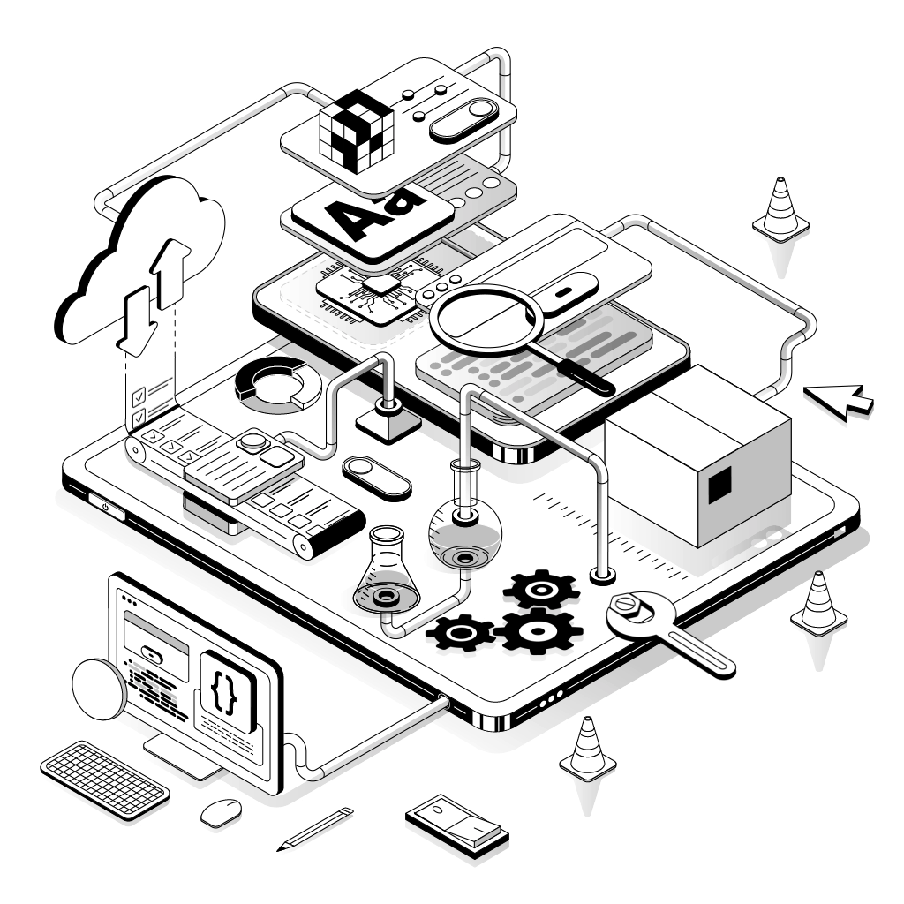

## How to write a proposal in upwork

### Job details

Looking for golang developer who can help to build API server that interact with database and various third-part APIs. Also, need help with CLI written in golang or python.

### Cover letter

Cover letter
Dear Hiring Manager,

Your job posting mentioned that you're looking for a Golang developer to help build an API server and a CLI. I am writing to express my interest in this position, as I believe I could bring valuable skills and experience to your project.

With over 4 years of experience in Golang development, I have worked extensively with building robust and scalable API servers. I have a deep understanding of how to interact with databases and third-party APIs, ensuring efficient data flow and seamless integration.

In addition to this, I have experience building command-line interfaces (CLI) in both Golang and Python. I understand the importance of creating user-friendly, efficient, and powerful CLI tools, and I am confident in my ability to deliver on this aspect of your project.

I am confident that my skills and passion for Golang make me a strong candidate for this role.

I look forward to the possibility of working with you and would be happy to further discuss how my skills and experience could benefit your project.

Best Regards,
Thang Pham
https://pxtha.com/

### Budget

I am looking for $20 per hour.

The project will take around 40 hours.

### Timeline

The project will take around 2-4 weeks to complete.

### Portfolio

Here are two projects that I have worked on and may related to what you need:

- https://github.com/pxtha/kit
- https://github.com/pxtha/meraki-media

### Contact

You can reach me at [web](https://pxtha.com/)

