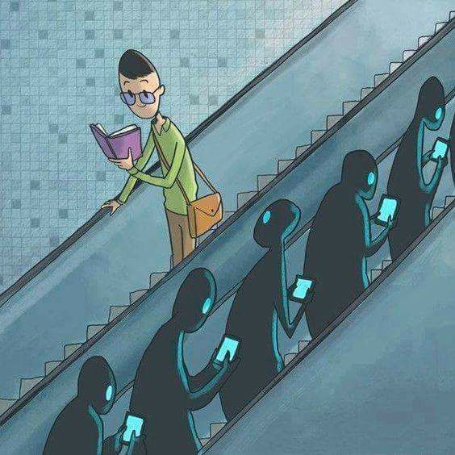

# Welcome to my Journey of Creating ShopTalk AI

## Introduction

In this blog series, I will be documenting my journey of creating my first SaaS product, ShopTalk AI. As a developer, I am excited to share my experiences, challenges, and learnings with you. In this first blog post, I will discuss how I am preparing my knowledge to start the project.

## The story

The idea for ShopTalk AI came to me while my girlfriend and I were dining at 4ps. We wanted to create a chatbot that could assist her in selecting clothes and accessories for her upcoming vacation. The AI would not only provide recommendations but also provide direct links to add the products to the cart for a quicker buying experience.

## Where to start

To begin my journey of creating ShopTalk AI, I believe it is important to start with thorough preparation and research. Drawing from my 4 years of industry experience, I understand the significance of having a well-defined and tested idea. 

As a first step, I have been following a series of Harvard i-lab videos on YouTube that discuss the best practices for building successful startups. - Kudos to Harvard

The agenda is:

- What It Takes: Vision, Mission & Culture

- Designing a Customer-Centric Business Model

- Value Props: Create a Product People Will Actually Buy

- How to Build a Product that Scales into a Company

## What It Takes: Vision, Mission & Culture

In this day one, I learned about the importance of having a clear vision, mission, and culture for a successful startup. These elements provide a guiding framework for the company's goals, values, and overall direction. A well-defined **vision** helps to inspire and motivate the team, while a **mission** statement outlines the purpose and objectives of the business. 

**Culture**, on the other hand, refers to the shared values, beliefs, and behaviors that shape the work environment and drive the company's success. 

By establishing a strong vision, mission, and culture, startups can align their efforts, attract like-minded individuals, and create a positive and productive work environment.

Here are some question can help you to define your own culture, mission and vision.

### Culture

