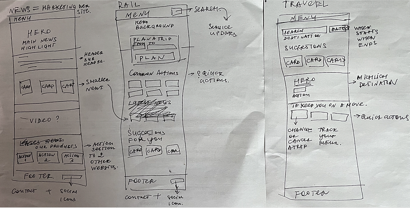

# Journey of Creating ShopTalk AI - Part 2
### Start with the Basics - MVP

### Vision

Help businesses to increase their sales by providing a personalized shopping experience to their customers.

### Mission

Our mission is to make shopping a joy with our AI chatbot that easily leads customers to their perfect products, making buying a snap. 

We're also passionate about helping Vietnamese businesses tap into the latest technology in a way that's affordable, easy, and quick.

### What is does?

ShopTalk AI is an AI chatbot that helps customers find the perfect products for them, making shopping a breeze. For example, if you're going to a wedding, our chatbot will help you find the perfect dress, shoes, and accessories to make you look and feel your best. The chatbot will provide direct links to buy the products, making the buying process quick and easy.

In addition to product recommendations, the chatbot will provide insights on the best deals and discounts available across various platforms. For businesses, the chatbot will offer insights into customer preferences and buying habits to help improve their sales and marketing strategies. The chatbot will support different platforms like Facebook Messenger, WhatsApp, Zalo, and websites.

### How it works?

**Natural Language Processing:** Using the ChatGPT API to understand and respond to customer queries. Providing a conversational experience that feels natural and engaging. Recommending products with link to buy based on customer preferences and needs.

**Product Management:** Simple steps for busniess to sync data from e-commerce platforms like **Shopee** to provide up-to-date product recommendations, including products links, prices, and reviews,...

**Platform Integration:** Supporting multiple platforms to ensure a seamless experience for both customers and businesses.

## How to Take Simple Steps to Creating the First MVP

- **Integrate the ChatGPT API** to handle natural language understanding and responses.
Develop a conversation flow to guide customers through product searches and recommendations.

- **Crawling Product Data of seller from Shopee**, setup a crawler service to gather data on products, links, prices, and deals from Shopee.
Use this data to provide up-to-date recommendations and insights to customers.

- **API for simple user interactions**, create an API to handle user interactions and provide product recommendations based on user preferences.

## System design for ShopTalk AI

### Dashboard
- This is where Seller manage their shoptalk instance
- View insights on customer preferences and buying habits
- View recommendations for customers
- Manage product data
- Manage endpoints
- Manage users

#### Products
- Sync data from their e-commerce platforms like Shopee, update product information, and view insights on customer preferences and buying habits.

#### Endpoints
- Manage endpoints for different platforms like Facebook Messenger, WhatsApp, Zalo, and websites.

### Shoptalks
- This is where customers interact with the Chatbot
- Get product recommendations
- Get insights on the best deals and discounts available
- Simple flow goes like: 
    - Customer asks for a product recommendation: what should I wear for my next vacation in next week in Da Nang?
    - Chatbot asks for customer preferences: what's your gender? what's your style? what's your size? what's your budget? what's your favorite color?
    - Chatbot provides product recommendations: 
    - Chatbot provides links to buy products

## Feature list for MVP

### Dashboard
- Seller register and login
- Seller manage their shoptalk instance:
  - Manage product data: 
    - sync product data from shopee: authen shopee account, sync product data
    - add product manually
    - update product information: tagging
    - delete product
  - Manage endpoints: what is this? research more 
    - add endpoint
    - update endpoint
    - delete endpoint
    - integrate with Facebook Messenger 
- Seller manage users: 
  - view user list
  - view user conversation history
  - view user insights: 
    - user basic information get from conversation: name, age, gender, location,
    - user needs of products: what they are looking for, what they like, what they dislike
    - user feedback recommendations: what product recommended to them, did they happy with that
    
### Shoptalks
- Customer interact with the Chatbot
  - Send message to chatbot
  - Answer chatbot questions
  - Get product recommendations
  - Click to view products, add products to cart, buy products

## Wireframe for MVP

