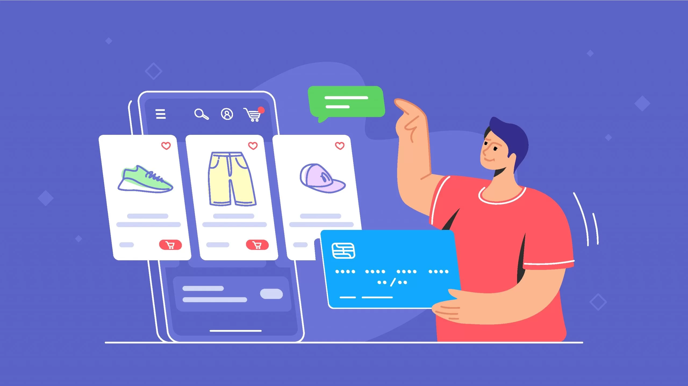

# Ecommerce Chatbots: Enhancing the Shopping Experience with AI

In today's digital age, ecommerce has become an integral part of our lives. With the rise of online shopping, sellers are constantly looking for ways to improve the shopping experience of their users. One technology that has gained significant traction in recent years is AI-powered chatbots.

## Optimizing the Shopping Experience

Ecommerce chatbots are designed to interact with users in a conversational manner, providing them with personalized recommendations, answering their queries, and assisting them throughout the shopping journey. By leveraging AI algorithms, these chatbots can analyze user preferences, purchase history, and browsing behavior to offer tailored product suggestions, discounts, and promotions.

## Increasing Revenue for Sellers

The primary goal of ecommerce chatbots is to help sellers increase their revenue. By providing a seamless and personalized shopping experience, chatbots can significantly improve customer satisfaction and loyalty. When customers feel understood and valued, they are more likely to make repeat purchases and recommend the seller to others.

Moreover, chatbots can also assist in upselling and cross-selling. By analyzing user data and understanding their needs, chatbots can suggest complementary products or upgrades, increasing the average order value and maximizing revenue for sellers.

## Bringing Sellers Closer to Technology

One of the key advantages of ecommerce chatbots is that they bring sellers closer to technology in the easiest way possible. Implementing complex AI algorithms and natural language processing capabilities can be daunting for many sellers. However, with chatbot platforms and frameworks readily available, sellers can easily integrate chatbots into their ecommerce platforms without extensive technical knowledge.

By harnessing the potential of AI, sellers can leverage chatbots to automate customer support, streamline order processing, and provide round-the-clock assistance to their customers. This not only improves operational efficiency but also frees up valuable time for sellers to focus on other aspects of their business.

## Conclusion

Ecommerce chatbots have revolutionized the way sellers interact with their customers. By optimizing the shopping experience through AI-powered personalization and assistance, chatbots help sellers increase revenue and build stronger customer relationships. With the ease of implementation and the potential for significant business impact, ecommerce chatbots are a must-have tool for any seller looking to stay competitive in the digital marketplace.

So, if you're a seller looking to enhance your ecommerce business, it's time to embrace the power of chatbots and unlock the full potential of AI.
