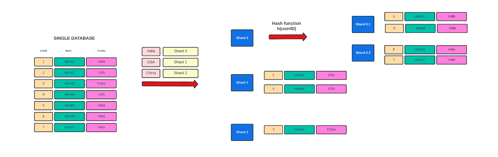

# System Design Beginner
- https://interviewready.io/learn/system-design-course/basics/horizontal_vs_vertical_scaling?autoplay=true
## Fundamentals
### Basics
#### 1. Horizontal vs Verical Scaliing

- Horizontal scaling is adding more machines to deal with increasing requirements.

- Vertical scaling is replacing the current machines with more advanced machines to improve throughput and hence response time.

#### 2. Monoliths vs Microservices

Monoliths: 
- Pros:
  - good for smal team
  - lex complex
  - less duplication
- Cons:
  - require more context for new member
  - complicated deploy, need to build the hold system
  - single point of failure

Microservices;
- Pros:
  - easier for new member, less context to understand the code
  - team can work parallel
  - easy to deploy, indivitual deploy service
- Cons:
  - Need skilled architect
  
#### 3. Sharding

- Sharding: horizontal partitioning of data according to a shard key.
- Types of sharding architectures:
  - Range base sharding
  - Key base sharding / hash-based sharding
  - directory base sharding: the lookup maps each key to the shard, the lookup is a single point of failure

- Hierarchal Sharding
  - Do sharding on the large shard

#### 4. Single Point of failure
To mitigate the problem:
- use multiple instances of every component in the service
- add backup the switch to over failure
- have multiple regions

#### 5. Service discovery and heartbeats
-  heartbeat service can be used to maintain system state,  when a server crashes, the heartbeat service indentify and restart the service imeediately
- Service Discovery is another important part of deploying and maintaining systems. The load balancer is able to adapt request routing.

In summary, service discovery helps services find each other, while heartbeat mechanisms ensure that services are running and healthy.

Both features allow the system to report and heal issues efficiently.