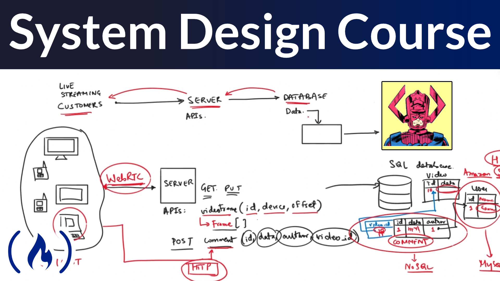

# System Design Beginner
- https://interviewready.io/learn/system-design-course/basics/horizontal_vs_vertical_scaling?autoplay=true
## Fundamentals
### Basics
#### 1. Horizontal vs Verical Scaliing

- Horizontal scaling is adding more machines to deal with increasing requirements.

- Vertical scaling is replacing the current machines with more advanced machines to improve throughput and hence response time.

#### 2. Monoliths vs Microservices

Monoliths: 
- Pros:
  - good for smal team
  - lex complex
  - less duplication
- Cons:
  - require more context for new member
  - complicated deploy, need to build the hold system
  - single point of failure

Microservices;
- Pros:
  - easier for new member, less context to understand the code
  - team can work parallel
  - easy to deploy, indivitual deploy service
- Cons:
  - Need skilled architect
  

