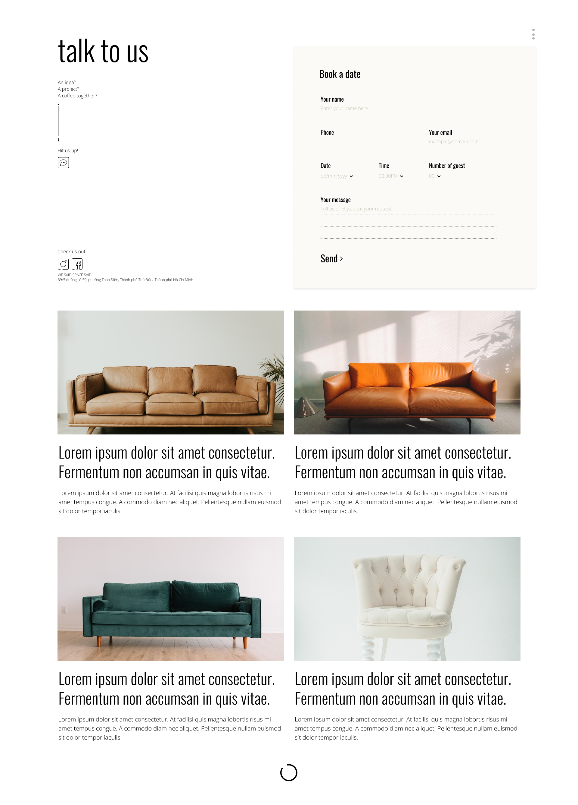

## Project Summary

The We Said Space Said project was initiated to address the need for a comprehensive booking and management system for a workshop architecture coffee station. The project includes a landing page, a booking page, and an admin page for managing bookings. 

The system was designed to provide a seamless user experience for customers looking to book a space at the coffee station, while also providing administrators with a robust and intuitive platform for managing these bookings. 

### Key Features

- User-friendly landing and booking pages
- Admin page for managing bookings
- User registration and authentication system
- Real-time availability and booking system
- Secure payment processing
- Real-time notifications
- Detailed reporting and analytics for administrators

### Technologies Used

#### Front-end:
- **ReactJS**: Used for building the user interface, providing a responsive and interactive experience.

#### Back-end:
- **Golang**: The backend service is written in Golang, providing excellent performance and simplicity.

#### Database:
- **PostgreSQL**: This is our primary relational database, known for its reliability and robustness.

#### Deployment:
- **AWS EC2**: The application is deployed on an AWS EC2 instance, providing scalability and reliability.

For more details about the project, please visit the [Wesaidspacesaid Page](https://wesaidspacesaid.com/).